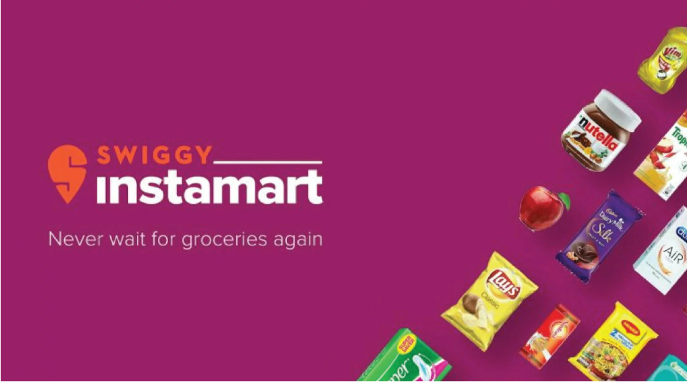
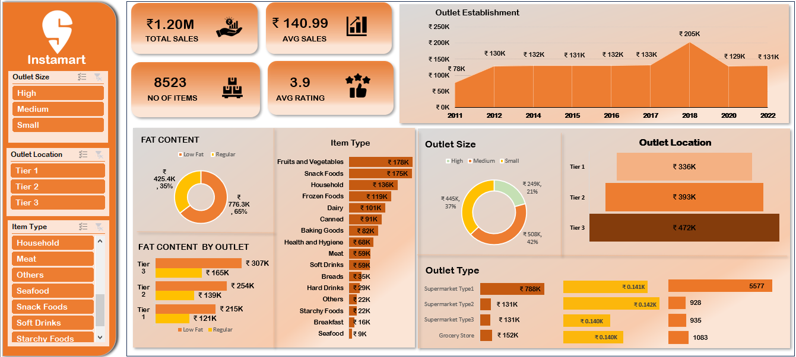

# 🍎🥛 Instamart Sales Analysis

  

## Project Overview
The Instamart dashboard provides a complete analysis of sales across different outlet types, sizes, item categories, locations, fat content preferences, and establishment years. It helps assess performance trends, consumer preferences, and area-wise growth opportunities using critical metrics like total sales, item count, average sales, and ratings

## Dataset Overview

| Column Name                 | Data Type   | Description                                                                |
|-----------------------------|-------------|----------------------------------------------------------------------------|
| `Item Fat Content`          | `object`    | Indicates whether the item is **Low Fat** or **Regular**.                  |
| `Item Identifier`           | `object`    | Unique identifier for each product.                                        |
| `Item Type`                 | `object`    | Category/type of item (e.g., Fruits and Vegetables, Dairy, Canned).        |
| `Outlet Establishment Year` | `int64`     | Year in which the outlet was established.                                  |
| `Outlet Identifier`         | `object`    | Unique ID for each retail outlet.                                          |
| `Outlet Location Type`      | `object`    | Tier category of the outlet's location (Tier 1, Tier 2, Tier 3).           |
| `Outlet Size`               | `object`    | Size classification of the outlet: Small, Medium, or High.                 |
| `Outlet Type`               | `object`    | Type of outlet (e.g., Supermarket Type1, Grocery Store).                   |
| `Item Visibility`           | `float64`   | Fraction of total display area dedicated to the product.                   |
| `Item Weight`               | `float64`   | Weight of the item in kilograms.                                           |
| `Sales`                     | `float64`   | Final sales value of the product at the outlet (in INR).                   |
| `Rating`                    | `float64`   | Customer rating of the item (typically on a scale from 1 to 5).            |

## 📊 Analytics and Insights

  

1. **KPI Insights**
   
| Metric               | Value   | Interpretation                                                                                     |
| -------------------- | ------- | ---------------------------------------------------------------------------------------------------|
| **Total Sales**      | ₹1.20M  | Healthy overall revenue. A strong baseline for scaling                                             |
| **Avg Sales**        | ₹140.99 | Indicates modest per-transaction or per-item sales, suggesting a focus on low- to mid-priced items |
| **Total Items Sold** | 8,523   | High movement of stock – strong product demand                                                     |
| **Avg Rating**       | 3.9 / 5 | Slightly below ideal – likely issues with service, quality, or delivery consistency                |

2. **Sales Trend Over Time (2011–2022)**
   
| Year      | Sales (₹)           |
| --------- | ------------------- |
| 2011–2015 | ₹78K–₹132K          |
| 2016–2018 | Growth to ₹205K     |
| 2019–2022 | Declined to \~₹130K |

  - Sales peaked in **2018**—possibly due to new launches, marketing push, or product expansion
  - Since then, sales have declined or stagnated.This plateau in growth may signal rising competition, market saturation, or customer churn

3. **Sales by Outlet Type**

| Outlet Type           | Sales | No. of Items | Avg. Sale per Item |
| --------------------- | ----- | ------------ | ------------------ |
| **Supermarket Type1** | ₹788K | 5,577        | ₹141               |
| Type2                 | ₹131K | 928          | ₹141               |
| Type3                 | ₹152K | 935          | ₹162               |
| Grocery Store         | ₹152K | 1,083        | ₹140               |

  - **Supermarket Type1** is the dominant format by far (65%+ of sales)
  - Others are niche, but maintain similar or better average sales per item

4. **Sales by Outlet Location**

| Location | Sales | Share |
| -------- | ----- | ----- |
| Tier 3   | ₹472K | 39%   |
| Tier 2   | ₹393K | 33%   |
| Tier 1   | ₹336K | 28%   |

  - **Tier 3** cities show highest revenue. These may have fewer competitors and strong customer loyalty
  - Urban Tier 1 shows lowest sales – possibly due to high competition or lower demand for mid-market brands

5. **Sales by Outlet Size**

| Size   | Sales | Share |
| ------ | ----- | ----- |
| Small  | ₹508K | 42%   |
| Medium | ₹445K | 37%   |
| High   | ₹249K | 21%   |

  - Small outlets outperform all others – more agile, cost-effective, and possibly better localized
  - Larger outlets may have higher overheads but lower efficiency

6. **Sales by Item Type**

| Category             | Sales      |
| -------------------- | ---------- |
| Fruits & Vegetables  | ₹178K      |
| Snack Foods          | ₹175K      |
| Household            | ₹136K      |
| Frozen Foods         | ₹119K      |
| Dairy, Canned, Baked | ₹80K–₹100K |
| Beverages, Breakfast | < ₹30K     |

  - Essentials (fresh produce, snacks) dominate sales
  - Low revenue from breakfast and beverage items—may indicate inventory gaps or poor placement

7. **Fat Content Preferences**

| Fat Type | Sales   | Share |
| -------- | ------- | ----- |
| Regular  | ₹776.3K | 65%   |
| Low Fat  | ₹425.4K | 35%   |

  - Regular fat dominates – traditional preferences still strong
  - Health-conscious products are a growing but niche segment
  - Tier 3 favors Regular (₹307K) far more than Low Fat (₹165K)
  - Tiers 1 & 2 show growing Low Fat preference

8. **Customer Sentiment (Average Rating)**
   - Rating = 3.9/5: Moderate satisfaction could be related to delivery delays, stock-outs, or service quality

- Business Recommendations
  - Expand micro-warehouses and logistics hubs in **Tier 2/3 areas**
  - Tailor product assortment and marketing campaigns to local tastes and spending patterns
  - Scale small-format stores in fast-moving zones and gradually reduce underperforming formats like Grocery Stores and Type2/3 supermarkets
  - Since fruits & Vegetables, Snack Foods, Household, and Frozen Foods are top-selling categories, maintain strong inventory levels and faster restocking for these categories
  - Introduce value packs, combo offers, and seasonal bundles for top categories
  - Since beverages, breakfast, and canned foods have the lowest sales, audit shelf placement and promotion strategies for these items
  - Explore partnerships with trending D2C brands to boost visibility and relevance
  - Average rating is 3.9, indicating room for improvementImplement real-time customer feedback collection at checkout
  - Regular fat items dominate, but Tier 1 & Tier 2 locations show demand for low-fat options. Promote low-fat and health-conscious items via dedicated sections, wellness campaigns, or influencer tie-ups
  - Introduce trial packs and “healthy choice” badges on products
  - Relaunch targeted promotions, subscription models, and referral incentives
  - Target specific outlet zones and neighborhoods based on purchase patterns (e.g., promoting snacks more in student-populated areas)
  - Use sales and visibility data to design discount strategies for mid-performing SKUs that need a push
  - Based on strong performance in specific categories, launch private-label Instamart brands in: Fruits & Vegetables (farm-to-table), Household essentials (detergents, cleaners) etc.

## 📌 Conclusion

The Instamart Sales Analysis provides a comprehensive understanding of sales performance across multiple dimensions such as outlet type, size, location, product category, and customer preferences. The analysis revealed that **Supermarket Type1** and **small-sized outlets** generate the highest revenue, with **Tier 3 cities** emerging as the strongest contributors—indicating immense potential in semi-urban and underpenetrated markets.

Product-wise, **fruits, vegetables, snacks, household, and frozen foods** are the key sales drivers, while low-fat items are gaining popularity in urban zones, suggesting a growing shift toward health-conscious buying. However, the **average customer rating of 3.9** points to the need for improvements in service, delivery, and product quality. Additionally, the sales plateau observed post-2018 indicates the urgency to revamp marketing and retention strategies.

Overall, the dashboard empowers Instamart to make **data-driven decisions** focused on regional expansion, product optimization, customer satisfaction, and operational efficiency—ultimately leading to sustainable growth and market leadership in the hyperlocal grocery delivery segment.

